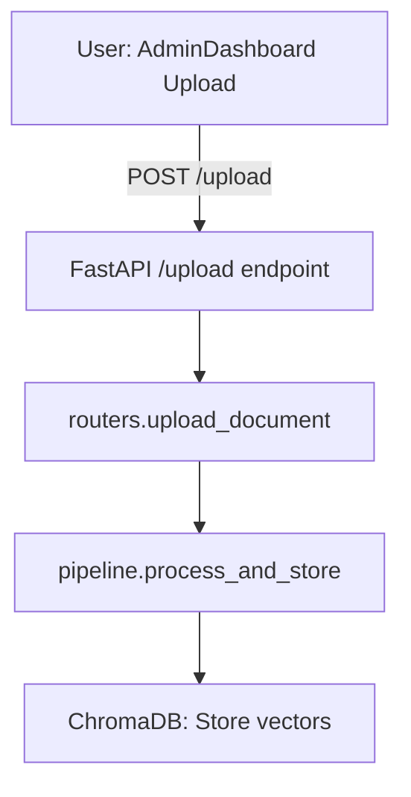
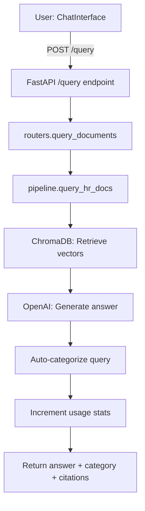
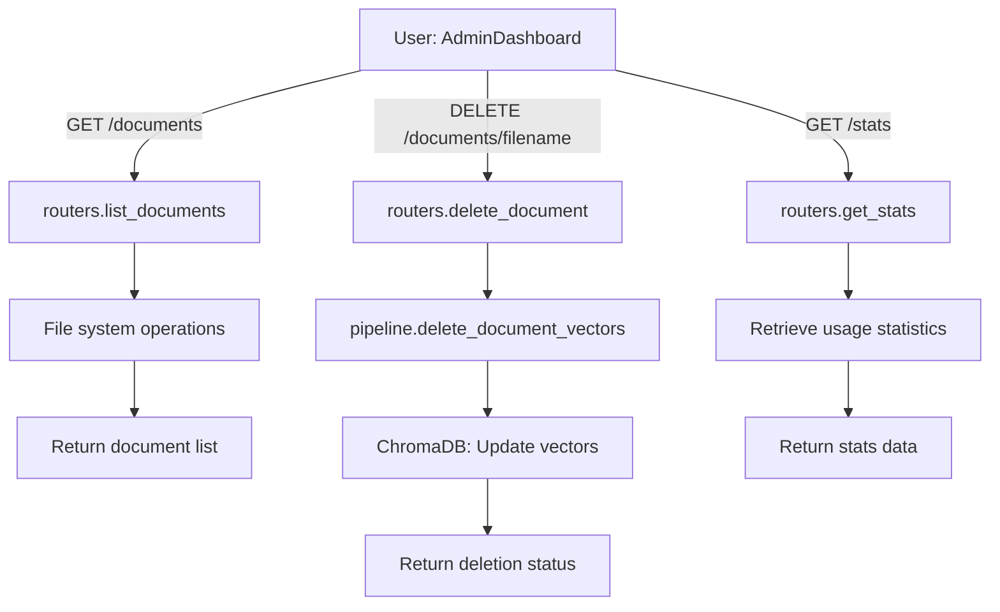

# System Flow: HR Onboarding Knowledge Assistant

This document explains the flow of core operations (document upload, query, and admin actions) both as step-by-step arrows and as Mermaid diagrams.

---

## 1. Document Upload Flow

**Step-by-step:**

```
User (AdminDashboard Upload) 
  ↓
POST /upload (FastAPI endpoint)
  ↓
routers.upload_document (backend/routers.py)
  ↓
pipeline.process_and_store (backend/pipeline.py)
  ↓
ChromaDB: Store vectors with metadata
```

**Mermaid:**


---

## 2. Employee Query Flow

**Step-by-step:**

```
User (ChatInterface) 
  ↓
POST /query (FastAPI endpoint)
  ↓
routers.query_documents (backend/routers.py)
  ↓
pipeline.query_hr_docs (backend/pipeline.py)
  ↓
ChromaDB: Retrieve vectors
  ↓
OpenAI: Generate answer
  ↓
Auto-categorize query (Benefits/Leave/Conduct/General)
  ↓
Increment persistent usage stats
  ↓
Return answer + category + citations to frontend
```

**Mermaid:**


---

## 3. Admin: List, Delete, and Stats

**Step-by-step:**

```
User (AdminDashboard)
  ↓
GET /documents, DELETE /documents/{filename}, GET /stats (FastAPI endpoints)
  ↓
routers.list_documents / delete_document / get_stats
  ↓
File system & pipeline.delete_document_vectors (for delete)
  ↓
ChromaDB: Update vector store (no persist() needed on delete)
  ↓
Backend persists document categories
  ↓
Return status/data to frontend
```

**Mermaid:**


---

For more details, see the code in `backend/routers.py` and `backend/pipeline.py`.
